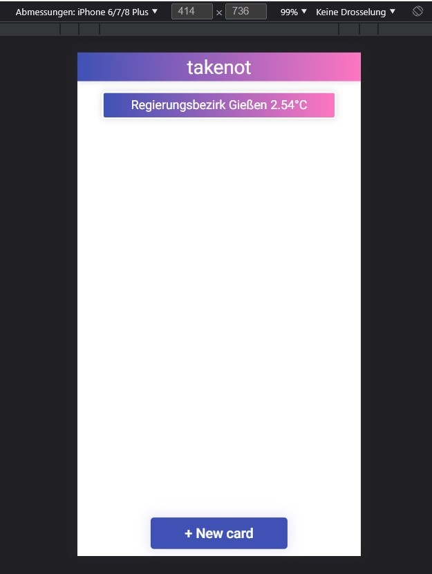
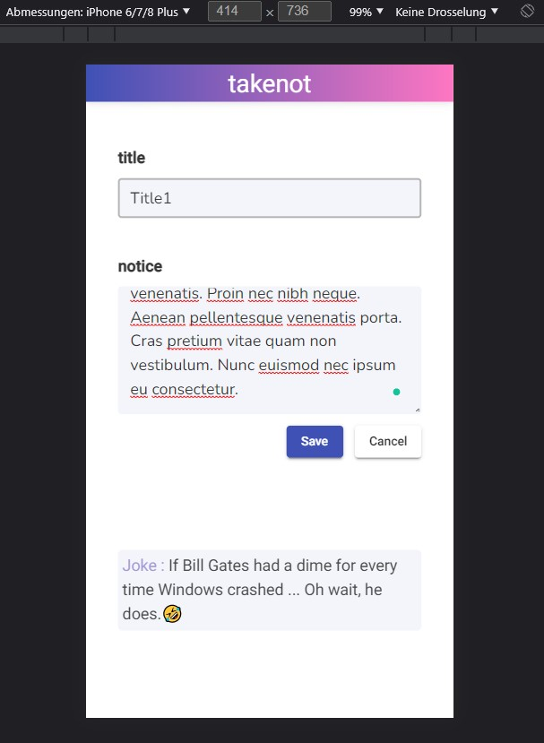
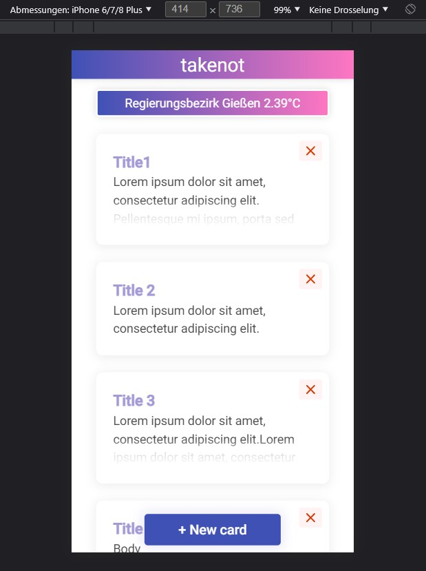

# takenot

## installation

1. Clone the repository :
    `git clone https://git.thm.de/yeot27/notepad.git`
2. In the notepad-frontend folder:
    - `npm install` 
    - `ng serve -o`

-------------------------------------------------------------------------------------------------------------------

## Vision Statement

Accompany your daily life by helping you to remember what is important to you.

-------------------------------------------------------------------------------------------------------------------

## screenshots

  
  
  

---------------------------------------------------------------------------------------------------------------------

## copyright

©spiderMonkey_237